<p align="center">
  
</p>

<p align="center">
  <em>Um homem que perdeu sua razão para viver. Uma fenda carmesim que responde à ausência.</em>
</p>

<p align="center">
  Metroidvania 2D em pixel art, feito na <strong>Godot 4</strong> (GDScript).
</p>

<p align="center">
  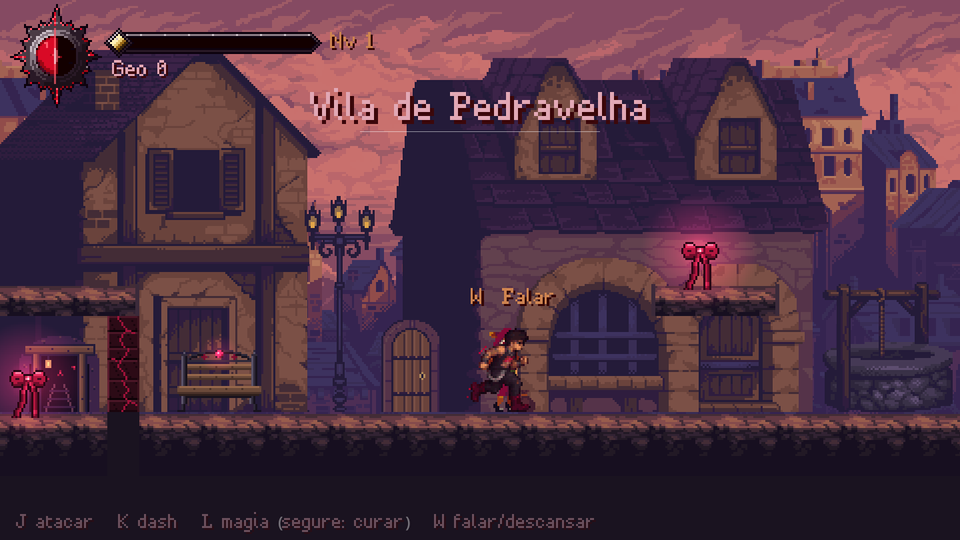
</p>

## O jogo

**NOCT: Crimson Rift** é um metroidvania 2D em pixel art. Você controla Noct, um viajante que aceita trabalhos,
entra em ruínas por dinheiro e chama isso de liberdade. Na verdade, está fugindo.

Desde que perdeu Mira, uma energia carmesim responde a ele. Ele a odeia. E precisa dela. De Pedravelha até o
fundo da Fenda, cada área guarda um chefe, uma lembrança e uma pergunta que ele evita fazer em voz alta.

> *E se ela morreu por minha causa?* (Noct)

- **Combate de perto.** Socos, chutes, cruzados e combos no chão e no ar. Dash, pulo duplo e golpe carregado
  para quem aprende o ritmo de cada inimigo.
- **A Fenda Carmesim.** A energia que vive em Noct não obedece a selos. Com ela, ele lança magias, cura feridas
  e, mais tarde, atravessa paredes carmesim.
- **A Forma Demoníaca.** Quando o poder deixa de ser surto e vira escolha, Noct assume a forma da raposa
  carmesim, com garras, investidas e a Raposa Espectral.
- **Memórias de Mira.** Fragmentos dela estão espalhados pelo mundo. Cada um devolve a Noct um pedaço do que
  ele tentou esquecer.
- **Seis áreas.** Um refúgio e cinco regiões, cada uma com cenários no estilo do seu chefe e terminando na sala dele.
- **Dois finais.** No fim da estrada, Noct precisa decidir o que fazer com a porta que ela fechou.

## Noct

<p>
  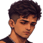
  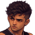
  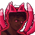
</p>

Aceita trabalhos, entra em ruínas por dinheiro e chama isso de liberdade. Responde quase tudo com sarcasmo, e o
sarcasmo é a armadura que sobrou.

Carrega no pulso uma fita carmesim e não diz de onde ela veio. Quando mente, coça a sobrancelha. Diante de
inimigos enormes, sorri de canto.

Mira o chamava de idiota com carinho. Ele a chamava de *raposinha*. No banco da estação, ela sentava à esquerda
e ele à direita. Hoje o lado esquerdo fica vazio.

| | |
|---|---|
| **Arma** | Os próprios punhos |
| **Marca** | A fita carmesim de Mira |
| **Poder** | A Fenda, que responde à ausência |

**Noct e a Forma Demoníaca (parado e correndo):**

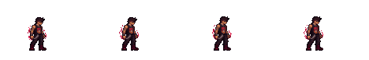<br>
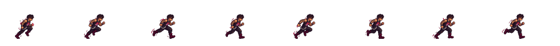<br>
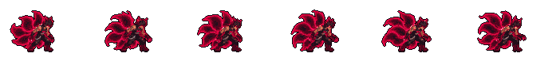<br>
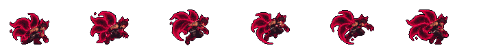

## O mundo

O mundo se divide em seis áreas. Pedravelha é o refúgio; as outras cinco terminam na sala de um chefe.

| Área | Chefe | |
|---|---|---|
|  | **Pedravelha**<br>Refúgio, sem chefe | Duas saídas, uma torre e gente demais olhando pela janela. Aqui ficam o banco, a loja do Brom e a Irmã Lívia. Embaixo da vila, um poço desce mais do que deveria. |
| 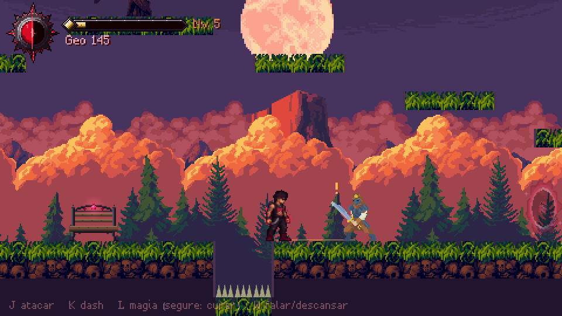 | **Trilha dos Desgarrados**<br>Capitão dos Saqueadores | O Bosque e a Serra, tomados por um bando que rouba carroças e leva gente. Um vigia guarda uma das trilhas há tanto tempo que esqueceu para quem. |
| 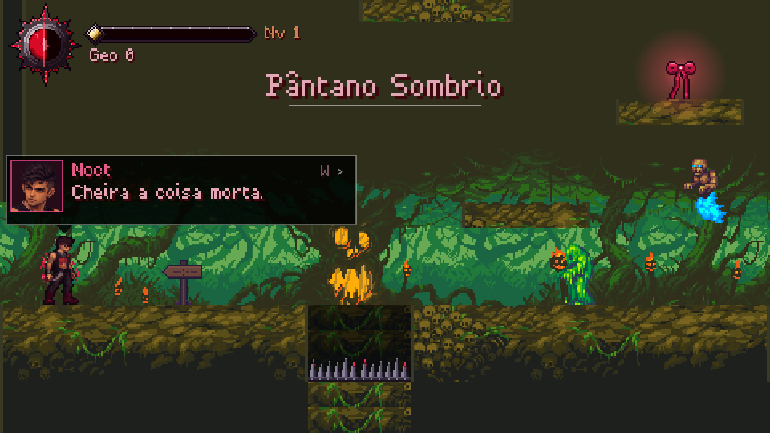 | **Terras Esquecidas**<br>Gato Infernal | O pântano a leste que engoliu muitos viajantes, o cemitério e, além dele, a toca de uma fera que as pessoas só mencionam baixinho. |
| 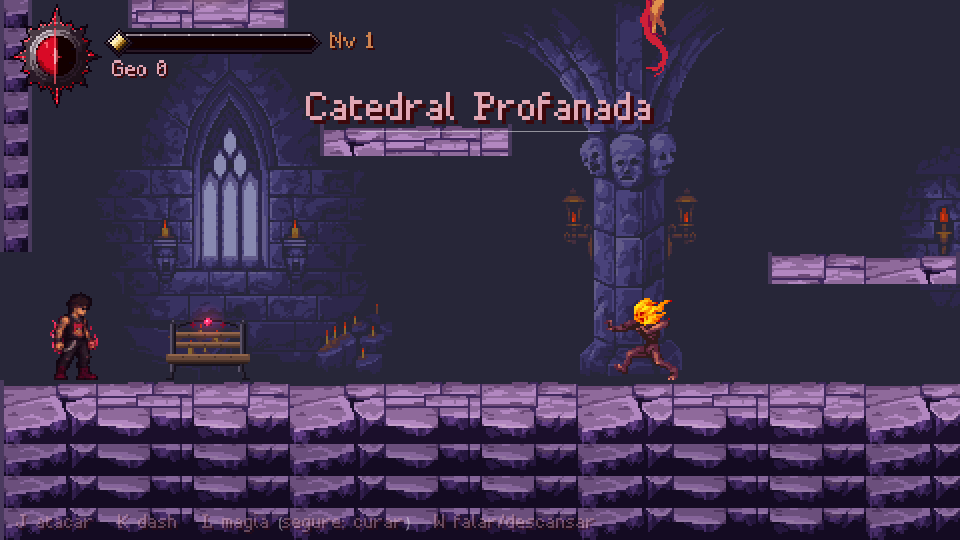 | **Domínio do Ceifador**<br>Bringer of Death | A Catedral Profanada, as ruínas arcanas e um arquivo submerso onde alguém registrava as almas presas no selo. |
| 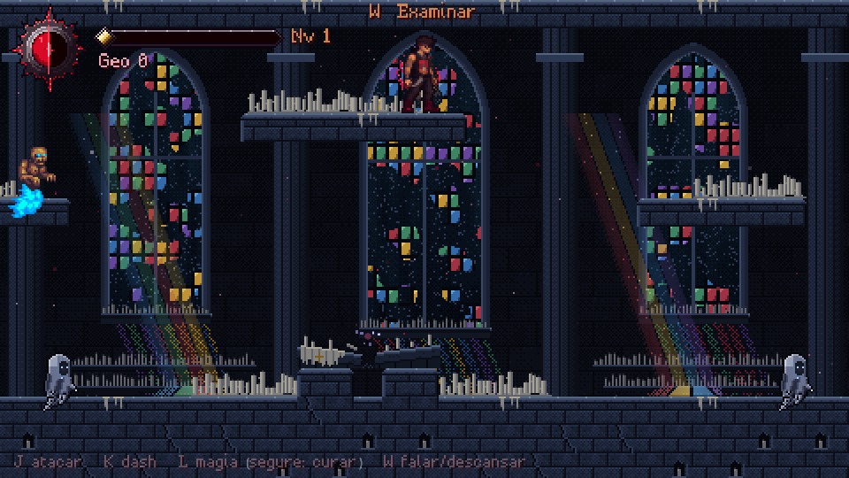 | **Águas Veladas**<br>Velário, o Carcereiro | A margem do lago, a Capela da Vigília, o Penhasco da Chuva Eterna e o Lago Velado, onde fica guardado o que Noct escolheu esquecer. |
| 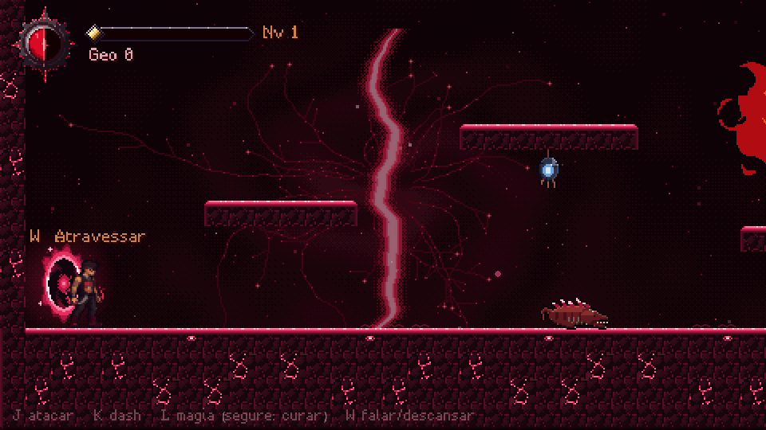 | **A Fenda**<br>Demon Slime | As Minas da Fenda, onde o veio cantava quando alguém na vila chorava. Depois, o Coração da Fenda, o Inferno e o Trono do Demônio. |

## Personagens

| | Quem | |
|---|---|---|
| 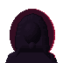 | **Mira**<br>A dona da fita | A única pessoa que atravessou as defesas de Noct. Ria do sarcasmo dele em vez de se assustar. |
| 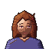 | **Tessa**<br>Também ouve a fenda | Diz que parece alguém chamando do outro lado de uma porta. |
| 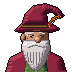 | **Velho Zeno**<br>Morador de Pedravelha | O primeiro a receber Noct na vila. Avisa que o pântano a leste engoliu muitos viajantes. |
| 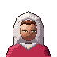 | **Irmã Lívia**<br>Religiosa de Pedravelha | Perguntou da fita no pulso dele. "É só uma fita." Os dois sabem que é mentira. |
| 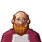 | **Ferreiro Brom**<br>Ferreiro de Pedravelha | Quem vai enfrentar o que vive além do cemitério passa por ele antes. |
| 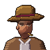 | **Forasteiro**<br>Viajante de chapéu | "E o resto?" "O resto ocupa a cabeça." |
| 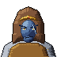 | **Capitão**<br>Líder dos saqueadores | Perguntou se Noct ia bancar o herói. "Não. Só não gosto de você." |
| 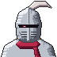 | **Vigia Errante**<br>Guardião da trilha | Guardou uma trilha do Bosque por tanto tempo que esqueceu para quem. |
| 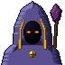 | **Custódio**<br>Mago da Ruína | "Então pertence ao selo." "Não pertenço a nada." |

**Chefes**

<p>
  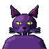
  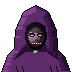
  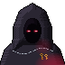
  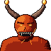
</p>

Gato Infernal · Bringer of Death · Velário · Demon Slime

## A história

*Noct e a Fenda Carmesim* é a história do jogo contada como um livro: a mesma ordem e as mesmas falas, mas
vistas de dentro, com o que Noct pensa e se recusa a dizer em voz alta.

> *Toda porta que chama de noite já foi, um dia, alguém esperando do outro lado.*

Os capítulos já publicados estão no site do jogo (seção História), em [`site/`](site/). Para ver, abra
`site/index.html` no navegador.

## Controles

| Ação | Teclado | Controle |
|---|---|---|
| Andar | A / D ou setas | Direcional ou analógico esquerdo |
| Olhar para cima / baixo | W / S | Cima / Baixo |
| Pular (pulo duplo no ar) | Espaço ou Z | A |
| Atacar | J ou X | X |
| Dash | K, Shift ou C | RB ou RT |
| Magia | L ou V | B |
| Ultimate | U | Y |
| Forma Demoníaca (barra da Fenda cheia) | R | R3 |
| Mapa | M ou Tab | LB |
| Pausa | Esc ou P | Start |

## Como rodar

1. Instale a [Godot 4](https://godotengine.org/) (o projeto usa a versão 4.7, renderizador Compatibility).
2. Abra o `project.godot` na Godot e aperte **F5**. A cena inicial é a tela de título (`game/ui/title.tscn`).

O save fica em `user://save.json` (no Windows: `%APPDATA%\NOCT Crimson Rift\save.json`).

## Testes

Testes automáticos, sem janela. Cada um termina com `RESULTADO: N OK, 0 FALHOU`.

```
godot --headless --path . --script tests/smoke_test.gd
godot --headless --path . --script tests/regression_test.gd
godot --headless --path . --script tests/content_test.gd
godot --headless --path . --script tests/new_assets_test.gd
godot --headless --path . --script tests/story_test.gd
godot --headless --path . --script tests/areas_test.gd
godot --headless --path . --script tests/world_areas_test.gd
```

## Estrutura do projeto

| Pasta | O que tem |
|---|---|
| `autoload/` | sistemas globais: estado do jogo e save, configurações, áudio, controles |
| `game/` | código do jogo: herói, inimigos, chefes, magias, mundo e interface |
| `data/` | conteúdo sem lógica: salas, áreas, temas, loja, amuletos, memórias, mapa |
| `assets/` | arte e som usados pelo jogo |
| `art_source/` | arte-fonte (arquivos do Aseprite, pranchas, rostos) |
| `tools/` | ferramentas de exportação e recorte dos sprites |
| `tests/` | testes automáticos |
| `docs/` | documentação de design (personalidade do Noct, glossário, áreas, forma demoníaca) |
| `site/` | site de apresentação do jogo (HTML, CSS e JS puros) |

O mapa completo, com a tabela "Quero... / Onde mexer", está em [ESTRUTURA.md](ESTRUTURA.md).

## Créditos

Noct, o logo e a arte própria do jogo foram feitos para o jogo, no Aseprite. Arte de terceiros: Luis Zuno
(ansimuz), Clembod, Anokolisa e outros. Música: YannZ, Tom Feldmann, David J. Barrios, vitalezzz, MintoDog e
Pascal Belisle. Sons: Leohpaz e ansimuz.

Autores, links e licenças completos em [CREDITOS.md](CREDITOS.md).

---

Um jogo de **Felippe** ([@Snikrat](https://github.com/Snikrat)), feito com a Godot Engine 4.
